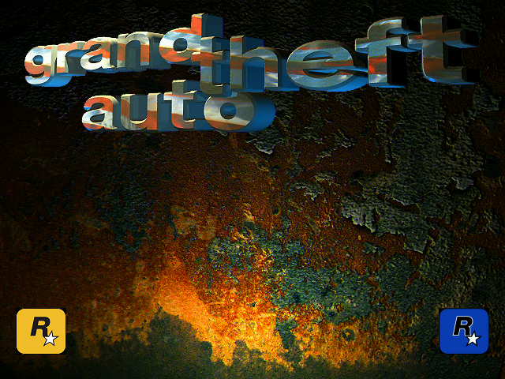

# Grand Theft Auto -- Static Recompilation

A static recompilation of the original **Grand Theft Auto** (1997) by DMA Design,
targeting modern Windows. No emulation: the original x86 machine code is lifted
to compilable C, linked against modern replacements for the legacy APIs, and
compiled into a native executable.

It renders.



*Frame 120 of a 200-frame capture. 552,201 of 614,400 bytes non-zero, 15,255
distinct colours, no crash. Every pixel comes from the game's own code -- the
recompiled MGL software renderer drawing into a surface the port hands it, then
blitting that surface to the primary through a DirectDraw shim built out of our
own COM vtables.*

## Project Status

| Phase | Status | Description |
|-------|--------|-------------|
| **Phase 0** | **Complete** | Binary analysis, PE parsing, installer extraction |
| **Phase 1** | **Complete** | Function discovery -- 2,590 functions over five rounds |
| **Phase 2** | **Complete** | Classification: import callers vs. pure game logic |
| **Phase 3** | **Complete** | x86-to-C lifting -- 952,581 lines of C, 0 errors |
| **Phase 4** | **Complete** | Compilation and linking |
| **Phase 5** | **Complete** | Runtime bringup -- CRT init, import bridging, WinMain |
| **Phase 6** | **Complete** | Win32/DirectDraw HAL -- COM shim, 75 vtable slots, window and surfaces |
| **Phase 7** | **In Progress** | **Frames, input and audio** -- the front end responds to keys and loads Liberty City through its own menu; sound effects play through a waveOut mixer. Remaining: the front end never starts the loaded game (see docs/PROGRESS.md) |

## What Works Today

The recompiled binary runs the game's own code from its CRT entry point to a
rendered title screen:

- **Maps at `0x400000`**, its original image base, through a self-relaunching
  launcher -- so every absolute address in the lifted code is simply correct
- **Enters through the lifted CRT startup**: heap, stdio, locale and codepage
  tables, argv, environment, then WinMain
- **All 166 imports bound by name** from the image's own import table
- **Reads its own data files** out of `..\gtadata\`, extracted from the original
  InstallShield cabinets
- **Creates its window**, negotiates a cooperative level and display mode, and
  gets a primary surface with a back buffer
- **Drives our DirectDraw**: `EnumDisplayModes`, `CreateSurface`, `Lock`/`Unlock`,
  `CreatePalette`/`SetEntries`, `Blt`/`BltFast`, `Flip` -- 75 slots across four
  interfaces, each a bridge cookie in a vtable built in game memory
- **Plays sound**: a waveOut software mixer stands in for the Miles Sound
  System -- 40 voices, sample format and rate from the game's own calls, and
  music tracks loaded from RIFF/WAVE
- **Renders**: hundreds of frames captured per run, no crash, running until the
  watchdog stops it
- **Takes input**: keys arrive as window messages, through `PeekMessageA` and
  `DispatchMessageA` into the game's own WndProc, and drive the front end

Left alone the game loops its title animation -- nine distinct frames, and
`GetKeyState` is never called. Send it keys and it reads them and moves on to
the city-select map: twenty-six distinct frames over the same interval. What it
does not do yet is navigate a menu through to actually starting a city.

## The Interesting Bugs

A recompilation fails a long way from its cause, so these are worth recording.

**Every zero looked negative.** The game asked for `..\GTADATA\AUDIO\LEVEL-00.RAW`
when the format string is `LEVEL%03d` and the file on disk is `LEVEL000.RAW`.
`%03d` of zero should print `000`; the port printed `-00`. The lifted `_output`
decides sign with `test edx,edx / jg / jl`, and the second of those two jumps sat
in a different basic block from the compare -- where the lifter had discarded
what set the flags and fell back to a stale carry. One branch, and every zero the
CRT ever formatted came out negative.

**One in nine functions started in the wrong place.** Blocks were emitted
lowest-address-first, and a function whose entry is not its lowest-addressed
block -- one sharing a body with a jump-table arm or a common tail -- began
executing in the wrong block. 295 of 2,590 functions, 11%, running code that was
never called.

**Flags that no single instruction set.** MSVC's signed-modulo idiom
(`and / jns / dec / or / inc / je`) reaches its final `je` from two predecessors
that set the flags with *different* instructions, so no static pairing exists.
474 branches were in that position. They now record which *kind* of instruction
wrote the operand snapshot and settle the condition at runtime, exactly.

Those three shared one symptom -- a conditional branch reading whatever carry
happened to be lying around -- and together accounted for 598 branches in GTA1
alone. Fixing them took the game from a failed display init to a title screen.

**Four bytes, one million times.** `AIL_ms_count` is `@0`, not `@4`; the bridge
popped one argument too many. The game busy-waits on it, so the stack pointer
climbed four bytes per call until it walked off the top of the simulated stack.
The exe's own decorated import names had said `@0` all along.

The full log is in [docs/BRINGUP.md](docs/BRINGUP.md), including the two theories
that were confidently wrong.

## Supported Games

| Game | Year | Executable | Compiler | Status |
|------|------|-----------|----------|--------|
| Grand Theft Auto | 1997 | `Grand Theft Auto.exe` | MSVC 6.0 | **Renders** |
| Grand Theft Auto | 1997 | `gtawin.exe` (original) | MSVC 4.2 | Analyzed |
| GTA London 1969 | 1999 | `gta_uk.exe` | MSVC 5.1 | **Lifted** (2,137 functions) |
| GTA London 1961 | 1999 | `GTA_61.exe` | MSVC 5.1 | Analyzed |
| Grand Theft Auto 2 | 1999 | `gta2.exe` | MSVC 5.1 | Blocked (TAC-packed) |

All of these share the **Race'n'Chase** engine, written by Mike Dailly at DMA
Design. GTA1 and GTA London run the identical engine -- London is a mission pack.
GTA2 evolves it onto DirectX 6, with similar file formats and game logic.

## Building

**Requirements**

- CMake 3.20+
- Visual Studio 2022 (MSVC), Win32 target
- Python 3.10+ with `capstone` and `pefile`
- SDL2 (optional; audio does not need it -- the mixer uses waveOut)
- The [pcrecomp](https://github.com/sp00nznet/pcrecomp) toolkit

**Step 1: lift the game**

This repository ships no lifted code. The C under `src/recomp/gen/` is
machine-translated from the game's own executable, so it is not ours to
distribute -- you generate it from your copy. Budget about an hour; the
disassembler makes five discovery passes over the binary.

```bash
python tools/run_pipeline.py "game/extracted_full/WINO/Grand Theft Auto.exe" --all --split 500 --functions-json config/functions_gta1.json
python tools/soften_fatal.py
```

That writes 2,590 functions as ~950k lines of C into `src/recomp/gen/`. Re-run it
after any change to the pcrecomp lifter.

**Step 2: build**

```bash
cmake -B build -G "Visual Studio 17 2022" -A Win32
cmake --build build --config Release
```

Add `-DGTA_TRACE=ON` for the crash trace ring.

## Game Data

You supply your own copy of the game. Extract the real data from the installer
cabinets:

```bash
python ../tools/tools/assets/isextract.py game/data1.cab game/data1.cab -o game/extracted_full
```

The archive spans `data1.cab` and `data2.cab`; the extractor discovers both and
reports the split (`Volumes: data1.cab [0..17], data2.cab [17..194]`). All 195
files should extract with no errors. The stub copy in `game/extracted/` is not
usable -- 171 of its 173 files are zero bytes.

## Running

```bash
cd game/extracted_full/WINO
/path/to/build/bin/Release/gta1.exe "Grand Theft Auto.exe"
```

Run from the directory holding the executable: the game resolves its data as
`..\gtadata\`, relative to its own location. The original executable is the
argument -- it is mapped at `0x400000` so the lifted code can read its `.rdata`
and `.data`.

To capture frames:

```bash
GTA_DUMP_FRAMES=200 GTA_WATCHDOG_MS=60000 gta1.exe "Grand Theft Auto.exe"
```

The other diagnostic switches are listed in [docs/BRINGUP.md](docs/BRINGUP.md).

## Architecture

```
src/
  common/       Shared types, math, memory model
  engine/       Recomp runtime, IAT bridges, image loader, premap launcher
  video/        DirectDraw shim, Smacker shim
  sound/        waveOut mixer replacing the Miles Sound System
  renderer/     Modern OpenGL 4.x, replacing SciTech MGL (not yet wired)
  net/          Network play replacing DirectPlay (stub)
  recomp/gen/           Lifted GTA1   -- 2,590 functions, 952,581 lines (generated)
  recomp/gen_london69/  Lifted London -- 2,137 functions, 205,665 lines (generated)
tools/
  run_pipeline.py   Analysis, discovery, lifting, code generation
  soften_fatal.py   Post-lift patch so one failed check does not hide the rest
config/
  functions_gta1.json   Discovered function list
docs/
  TECHNICAL.md   Engine, binary, formats, import surface
  BRINGUP.md     How it gets 0x400000, diagnostics, the fix log
  PROGRESS.md    Phase-by-phase detail and known gaps
```

## Statistics

| Metric | Value |
|--------|-------|
| Functions lifted (GTA1) | **2,590** |
| Lines of generated C | **952,581** |
| Lifting errors | **0** |
| Imports bound by name | **166 of 166** |
| DirectDraw methods served | 75 vtable slots |
| Stale-flag branches remaining | **0** (was 598) |
| Game executables analyzed | 5 |

## Documentation

- [docs/TECHNICAL.md](docs/TECHNICAL.md) -- the Race'n'Chase engine, GTA1's PE
  layout, subsystems, data formats, import surface, MGL notes
- [docs/BRINGUP.md](docs/BRINGUP.md) -- how the image gets its original base, the
  diagnostic switches, and the full fix log
- [docs/PROGRESS.md](docs/PROGRESS.md) -- phase checklists and known gaps

## License

The code in this repository is released under the [MIT License](LICENSE).

That covers **this project's own source** -- the runtime, the IAT bridges, the
DirectDraw, Miles and Smacker shims, the launcher and the tooling. Everything in
this repository is code written for this project.

It does **not** cover Grand Theft Auto itself. The game's binary, assets and data
remain the property of their owners and are not distributed here. Neither is the
lifted C: that is machine-translated from the original executable and carries
whatever rights the executable does, so it is generated on your machine, from
your copy, and never checked in.

## Legal

This project is for game preservation purposes. You must supply your own copy of
the game. No copyrighted game assets are included in this repository.

Rockstar Games have made Grand Theft Auto and Grand Theft Auto 2 freely available
for years, which is the only reason this project targets them rather than a title
still being sold. If the rights holders would prefer this not exist, say so and
it comes down.

## Credits

The game itself is the work of **DMA Design** -- **Mike Dailly** wrote the
Race'n'Chase engine this recompilation is built on, and it is a genuinely good
piece of 1990s engineering to read. Published by BMG Interactive, now
**Rockstar Games**, who released it as freeware.

Standing on:

- [pcrecomp](https://github.com/sp00nznet/pcrecomp) -- the unified PC static
  recompilation toolkit this project shares with its siblings
- [Capstone](https://www.capstone-engine.org/) -- disassembly
- [SDL2](https://libsdl.org/) -- audio, and eventually windowing and input
- **SciTech Software** for MGL and **RAD Game Tools** for Smacker and the Miles
  Sound System -- the libraries being stood in for here

## Related Projects

Part of the [sp00nznet](https://github.com/sp00nznet) recompilation collection:

- [xwa](https://github.com/sp00nznet/xwa) -- X-Wing Alliance, D3D11 backend and
  3D flight
- [burnout3](https://github.com/sp00nznet/burnout3) -- original Xbox x86 recomp
- [bw](https://github.com/sp00nznet/bw) -- Black & White, Win32 game patterns
- [civ](https://github.com/sp00nznet/civ) -- Civilization, 16-bit x86 lifting
